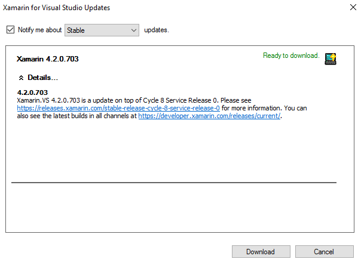

## Create a Visual Studio project
1. Open Visual Studio
1. Create a new project
1. Select "Visual C# > Cross-Platform" and choose the **Blank App (Xamarin.Forms Portable)** project
   
1. Discuss the difference between the two code-sharing strategies **Portable** and **Shared** (see [Sharing Code Options](https://developer.xamarin.com/guides/cross-platform/application_fundamentals/building_cross_platform_applications/sharing_code_options/) for further details)
1. Name the project **HelloAndroid**

## Setup environment
1. Set Java heap size in the app project settings
   
1. **Important**: The first build of the Xamarin app may last up to several minutes. Do not interrupt the build process as some download tasks are running in the background.

## Update Xamarin
1. Open Visual Studio
1. Open "Tools > Options" and select "Xamarin" 
   
1. Click "Check now"
1. Download and install update if available 
   