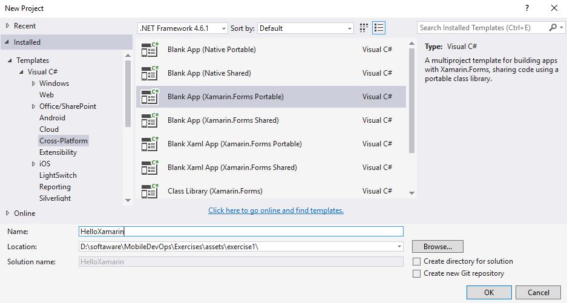
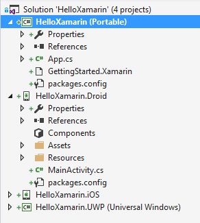
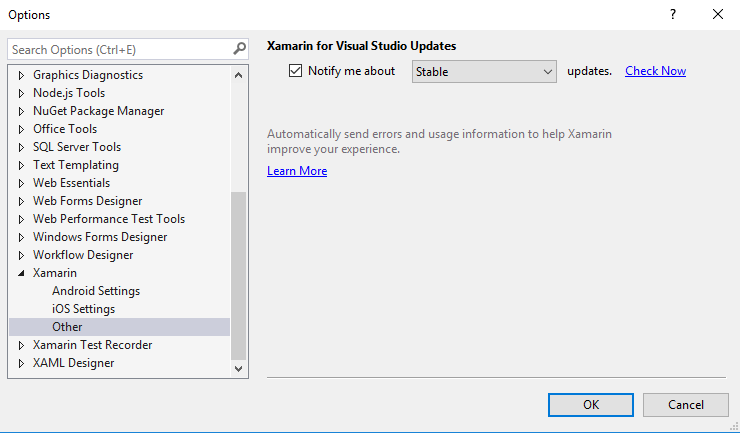

## Create a Visual Studio project
1. Open Visual Studio
1. Create a new project
1. Select "Visual C# > Cross-Platform" and choose the **Blank App (Xamarin.Forms Portable)** project
   
1. Discuss the difference between the two code-sharing strategies **Portable** and **Shared** (see [Sharing Code Options](https://developer.xamarin.com/guides/cross-platform/application_fundamentals/building_cross_platform_applications/sharing_code_options/) for further details)
1. Name the project **HelloAndroid**
1. Discuss the created project structure 
   

## Add NuGet-Packages
1. Open the NuGet Manager dialog for the project **HelloXamarin (Portable)**
1. Add **Microsoft.Net.Http**
1. Add **Newtonsoft.Json**
1. Add **MvvmLightLibs** 
   

## Create a ViewModel
1. Discuss MVVM architecture briefly
1. Create a folder **ViewModels** in the **HelloXamarin (Portable)** project
1. Create a class **AlbumViewModel.cs** in this folder
1. 

## Setup environment
1. Set Java heap size in the app project settings
   
1. **Important**: The first build of the Xamarin app may last up to several minutes. Do not interrupt the build process as some download tasks are running in the background.

## Update Xamarin
1. Open Visual Studio
1. Open "Tools > Options" and select "Xamarin" 
   
1. Click "Check now"
1. Download and install update if available 
   

## Delete Visual Studio ComponentModelCache
If you encounter error messages when creating a new Xamarin project (e.g. "A problem was encountered creating the sub project 'HelloAndroid.Droid'. Attempted to access a missing method."), try to remove the ComponentModelCache:
1. Close Visual Studio
1. Open file explorer in "%localappdata%\Microsoft\VisualStudio\14.0\ComponentModelCache"
1. Delete all the files
1. Open Visual Studio