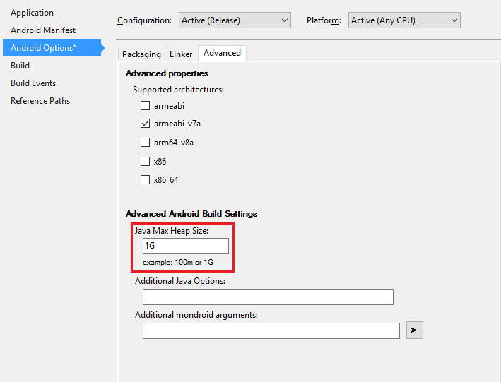
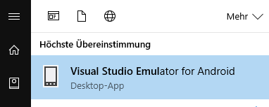
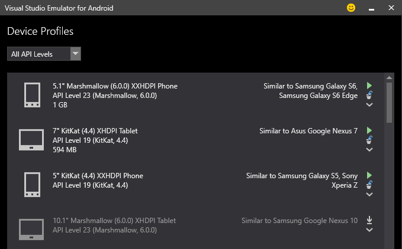

# Creating your first Xamarin App

## Learnings

1. Create a new Xamarin Forms App with Visual Studio
1. Learn about the MVVM architecture
1. Run your code in the Android emulator

## Create a Visual Studio project
1. Open Visual Studio
1. Create a new project
1. Select "Visual C# > Cross-Platform" and choose the **Blank App (Xamarin.Forms Portable)** project
   
1. Discuss the difference between the two code-sharing strategies **Portable** and **Shared** (see [Sharing Code Options](https://developer.xamarin.com/guides/cross-platform/application_fundamentals/building_cross_platform_applications/sharing_code_options/) for further details)
1. Name the project **HelloXamarin**
1. Discuss the created project structure<br/>
   

## Add and update NuGet-Packages
1. Open the NuGet Manager dialog for the project **HelloXamarin (Portable)**
1. Add **Microsoft.Net.Http**
1. Add **Newtonsoft.Json**
1. Add **MvvmLightLibs**<br/>
   
1. Update **Xamarin.Forms** NuGet package (if available)

1. Open the NuGet Manager dialog for the project **HelloXamarin.Droid**
1. Update **Xamarin.Forms** NuGet package to 2.3.2.127 (if available)
1. **Don't update** the Xamarin.Android.Support.* packages (incompatibility to Xamarin.Forms package)

## Create Models
1. Discuss MVVM architecture briefly
1. Create a folder **Models** in the **HelloXamarin (Portable)** project
1. Create two classes **Album** and **Photo**<br/>

    ```cs
    public class Album
    {
       public int Id { get; set; }
       public string Title { get; set; }
    }
    ```

## Create a ViewModel
1. Create a folder **ViewModels** in the **HelloXamarin (Portable)** project
1. Create a class **AlbumViewModel.cs** in this folder (see sourcecode below)
1. Discuss
   - ViewModelBase, INotifyPropertyChanged, Set-Method from MvvmLight
   - ICommand
   - Querying REST APIs

```cs
public class AlbumViewModel : ViewModelBase
{
    private IEnumerable<Album> albums;

    public IEnumerable<Album> Albums
    {
        get { return albums; }
        set { this.Set(ref albums, value); }
    }

    public ICommand LoadAlbumsCommand { get; set; }

    public AlbumViewModel()
    {
        this.Albums = new List<Album>();

        this.LoadAlbumsCommand = new RelayCommand(async () => await LoadAlbums());
    }

    public async Task LoadAlbums()
    {
        // Use System.Net.Http.HttpClient (NuGet) instead of Windows.Web.Http!
        using (var client = new HttpClient())
        {
            var json = await client.GetStringAsync("http://jsonplaceholder.typicode.com/albums");
            this.Albums = JsonConvert.DeserializeObject<IEnumerable<Album>>(json);
        }
    }
}
```

## Create a View
1. Add a new Item to the **HelloXamarin (Portable)** project
1. Choose **Forms Xaml Page** and name it **MainPage.xaml**
1. Discuss
   - Advantages and disadvantages of Xamarin.Forms layout syntax
   - Different controls (see [Xamarin Forms Control Reference](https://developer.xamarin.com/guides/xamarin-forms/controls/))
   - ListView control and cell types (see [ListView Control](https://developer.xamarin.com/guides/xamarin-forms/user-interface/listview/customizing-cell-appearance/))
   - DataBinding
1. Define the layout
    ```xml
    <?xml version="1.0" encoding="utf-8" ?>
    <ContentPage xmlns="http://xamarin.com/schemas/2014/forms"
                xmlns:x="http://schemas.microsoft.com/winfx/2009/xaml"
                x:Class="HelloXamarin.MainPage"
                Title="Albums">

    <StackLayout Orientation="Vertical">
        <Button Text="Load albums" Command="{Binding LoadAlbumsCommand}" />
        <ListView ItemsSource="{Binding Albums}">
        <ListView.ItemTemplate>
            <DataTemplate>
            <TextCell Text="{Binding Title}" />
            </DataTemplate>
        </ListView.ItemTemplate>
        </ListView>   
    </StackLayout>
    
    </ContentPage>
    ```   
1. Set the ViewModel in the Code-behind file
    ```cs
    public partial class MainPage : ContentPage
    {
        public MainPage()
        {
            InitializeComponent();

            this.BindingContext = new AlbumViewModel();
        }
    }
    ```

## Set start page
1. Open **App.cs**
1. Remove the sample code in the constructor and change it to<br/>

    ```cs
    public App()
    {
        MainPage = new NavigationPage(new MainPage());
    }
    ```


## Build and test
1. Build the solution<br/>
   **Attention**: The first build may last up to several minutes due to Xamarin download tasks in the background. Don't interrupt the build process.
1. Set Java heap size in the app project settings
   

1. Open **Visual Studio Emulator for Android** <br/>
   
1. Download an Emulator with API Level 23 (e.g. **5.1" Marshmallow (6.0.0) XXHDPI Phone API Level 23**, similar to Samsung Galaxy S6)<br/>
   
1. Switch to **Visual Studio**
1. Set the **HelloXamarin.Droid** app as your startup project
1. Start the app using the **emulator**
   

## Add detail Page
1. ZIP-File with the following files can be found [here](https://1drv.ms/u/s!AnByKdQdIw5Kgm3B1H7g2YvCBeg1).
1. Copy [**Photo.cs**](assets/exercise1/HelloXamarin/HelloXamarin/Models/Photo.cs) to the **Models** folder
1. Copy [**PhotoViewModel.cs**](assets/exercise1/HelloXamarin/HelloXamarin/ViewModels/PhotoViewModel.cs) to the **ViewModels** folder
1. Copy [**PhotoPage.xaml**](assets/exercise1/HelloXamarin/HelloXamarin/PhotoPage.xaml) and [**PhotoPage.xaml.cs**](assets/exercise1/HelloXamarin/HelloXamarin/PhotoPage.xaml.cs)  to the root folder
1. **Register an event handler** to the ListView in **MainPage.xaml**
   ```xml
   <ListView ItemsSource="{Binding Albums}" ItemTapped="OnAlbumTapped">
   ```

1. Add the following method to the Code-behind file<br/>
    ```cs
    private void OnAlbumTapped(object sender, ItemTappedEventArgs e)
    {
        var album = e.Item as Album;
        this.Navigation.PushAsync(new PhotoPage(album.Id));
    }
    ```


# Xamarin Troubleshooting

## Update Xamarin
1. Open Visual Studio
1. Open "Tools > Options" and select "Xamarin"<br/>
   
1. Click "Check now"
1. Download and install update if available<br/>
   

## Delete Visual Studio ComponentModelCache
If you encounter error messages when creating or opening a Xamarin project (e.g. "A problem was encountered creating the sub project 'HelloXamarin.Droid'. Attempted to access a missing method."): try to remove the ComponentModelCache:

1. Close Visual Studio
1. Open file explorer in "%localappdata%\Microsoft\VisualStudio\14.0\ComponentModelCache"
1. Delete all the files
1. Open Visual Studio