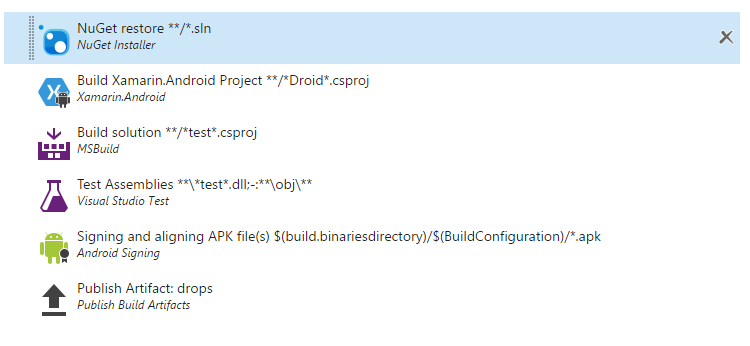
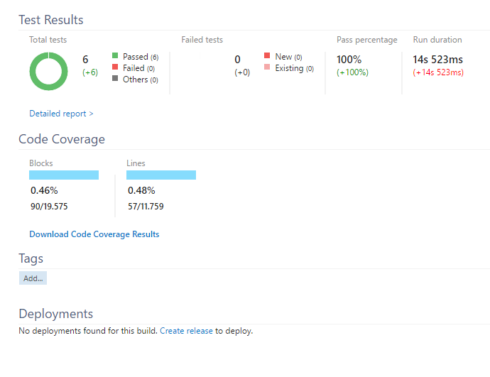

# Importance of testing your projects

## Learnings
1. [Create mock implementations](#create-an-interface-for-feed-retrieval)
1. [Unit-Tests](#create-a-unit-test)
1. [Build Automation with Unit-Tests](#build-automation-with-unit-tests)

## Create an interface for feed retrieval
1. Discuss the need of an interface
1. Create a folder **Manager**
1. Add a new interface called **IFeedManager.cs**<br/>
    ```cs
    public interface IFeedManager<T>
    {
        Task<IEnumerable<T>> LoadItemsAsync(string search = null);
    }
    ```

## Create an implementation for Twitter
1. Add a new class called **TwitterManager.cs**
1. You can copy most of the code from the existing **TwitterViewModel.cs**
    ```cs
    public class TwitterManager : IFeedManager<Tweet>
    {
        private IAuthorizer auth;

        public TwitterManager(string consumerKey, string consumerSecret)
        {
            this.auth = new ApplicationOnlyAuthorizer()
            {
                CredentialStore = new InMemoryCredentialStore
                {
                    ConsumerKey = "ZTmEODUCChOhLXO4lnUCEbH2I",
                    ConsumerSecret = "Y8z2Wouc5ckFb1a0wjUDT9KAI6DUat5tFNdmIkPLl8T4Nyaa2J",
                },
            };
        }

        public async Task<IEnumerable<Tweet>> LoadItemsAsync(string search = null)
        {

            await auth.AuthorizeAsync();

            var twitterContext = new TwitterContext(auth);

            var query = from tweet in twitterContext.Status
                        where tweet.Type == StatusType.User &&
                                tweet.ScreenName == "shanselman" &&
                                tweet.Count == 100 &&
                                tweet.IncludeRetweets == true &&
                                tweet.ExcludeReplies == true &&
                                (string.IsNullOrWhiteSpace(search) || tweet.Text.Contains(search))
                        select tweet;

            var queryResponse = await query.ToListAsync();

            return (from tweet in queryResponse
                    select new Tweet
                    {
                        StatusID = tweet.StatusID,
                        ScreenName = tweet.User.ScreenNameResponse,
                        Text = tweet.Text,
                        CurrentUserRetweet = tweet.CurrentUserRetweet,
                        CreatedAt = tweet.CreatedAt,
                        Image = tweet.RetweetedStatus != null && tweet.RetweetedStatus.User != null
                                    ? tweet.RetweetedStatus.User.ProfileImageUrl.Replace("http://", "https://")
                                    : (tweet.User.ScreenNameResponse == "shanselman"
                                        ? "scott159.png"
                                        : tweet.User.ProfileImageUrl.Replace("http://", "https://"))
                    }).ToList();
        }
    }
    ```

## Create a mock implementation
1. Add a new class called **MockTwitterManager.cs**
    ```cs
    public class MockTwitterManager : IFeedManager<Tweet>
    {
        public async Task<IEnumerable<Tweet>> LoadItemsAsync(string search = null)
        {
            await Task.Delay(2000);

            var items = new[] {
                new Tweet() { Text = "Tweet1" },
                new Tweet() { Text = "Tweet2" },
                new Tweet() { Text = "Tweet3" },
                new Tweet() { Text = "Tweet4" },
                // required for test
                new Tweet() { Text = "#shanselman" }
            };

            if (!string.IsNullOrWhiteSpace(search))
            {
                items = items.Where(i => i.Text.Contains(search)).ToArray();
            }

            return items;
        }
    }
    ```

## Create a factory (optional)
1. Discuss the advantages of a factory
1. Add a new class called **ManagerFactory.cs**
    ```cs
    public static class ManagerFactory
    {
        public static bool IsMocked { get; set; } = false;

        public static IFeedManager<Tweet> CreateTwitterManager(string consumerKey, string consumerSecret)
        {
            return IsMocked
                ? new MockTwitterManager() as IFeedManager<Tweet>
                : new TwitterManager(consumerKey, consumerSecret);
        }
    }
    ```

## Change the TweetViewModel
1. Change the affected rows of the **TweetViewModel** to use the new ManagerFactory
1. Add a private field<br/>

   ```cs
   private IFeedManager<Tweet> twitterManager;
   ```
1. Initialize the field in the constructor<br/>

    ```cs
    this.twitterManager = ManagerFactory.CreateTwitterManager(
        "ZTmEODUCChOhLXO4lnUCEbH2I",
        "Y8z2Wouc5ckFb1a0wjUDT9KAI6DUat5tFNdmIkPLl8T4Nyaa2J");
    ```
1. Load the tweets in the ExecuteLoadTweetsCommand method (at the beginning of try/catch)<br/>

    ```cs
    var tweets = await this.twitterManager.LoadItemsAsync();
    ```
1. Add a .ToList() in the iOS implementation to solve compiler error<br/>

    ```cs
    DependencyService.Get<ITweetStore>().Save(tweets.ToList());
    ```    


## Create a unit test
1. Add a new **Test project** called **Hanselman.Tests**
1. Create a unit test
    ```cs
    [TestClass]
    public class Tests
    {
        [TestInitialize]
        public void Init()
        {
            ManagerFactory.IsMocked = true;
        }

        [TestMethod]
        public async Task LoadTweets()
        {
            var viewModel = new TwitterViewModel();
            var task = viewModel.ExecuteLoadTweetsCommand();

            await CheckIfBusy(task, viewModel);

            Assert.IsTrue(viewModel.Tweets.Any());
        } 

        private async Task CheckIfBusy(Task task, BaseViewModel model)
        {
            Assert.IsTrue(model.IsBusy);
            Assert.IsFalse(model.IsNotBusy);

            await task;

            Assert.IsFalse(model.IsBusy);
            Assert.IsTrue(model.IsNotBusy);
        }
    }
    ```

## Further ideas
You can mock the podcast and blog retrieval as well, see details in the provided sample code. There are also more unit tests available in the solution. 


## Build Automation with Unit-Tests
The build template, created in [Exercise 2](exercise2.md) has to be changed.

1. Got to build definition
1. click **Edit** (top-right)
1. Add new build step
1. Select Category: Test / Visual Studio Test

1. Change the order of the build steps like picture below

1. Select Test Assemblies step and change setting **Test Assembly** to '$(build.binariesdirectory)/$(BuildConfiguration)/test-assembly/Hanselman.Tests.dll'

1. Save changes and queue new build

After success the test results appear in the build results overview page.

