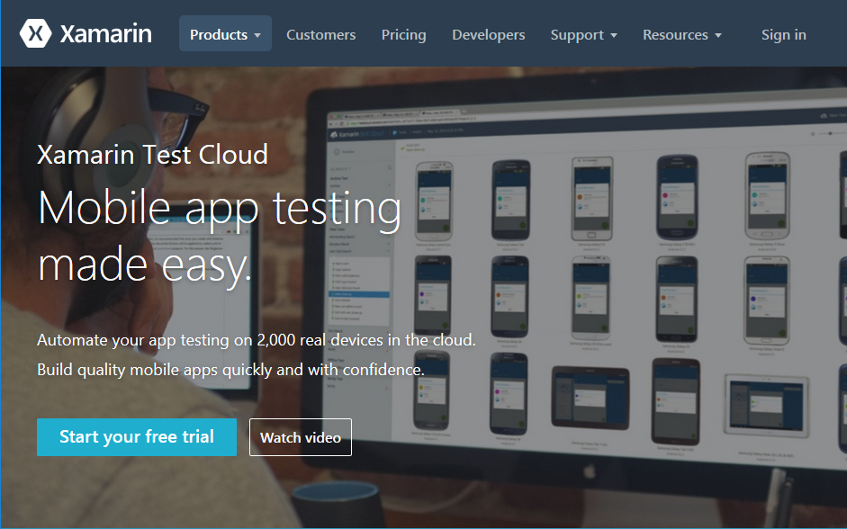
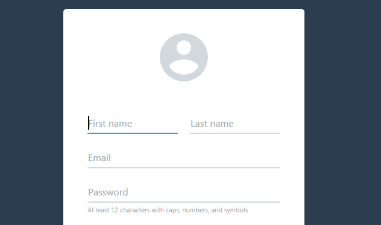
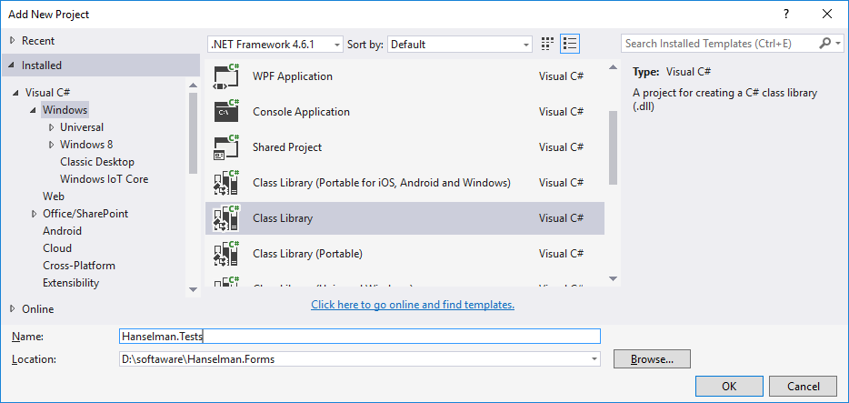
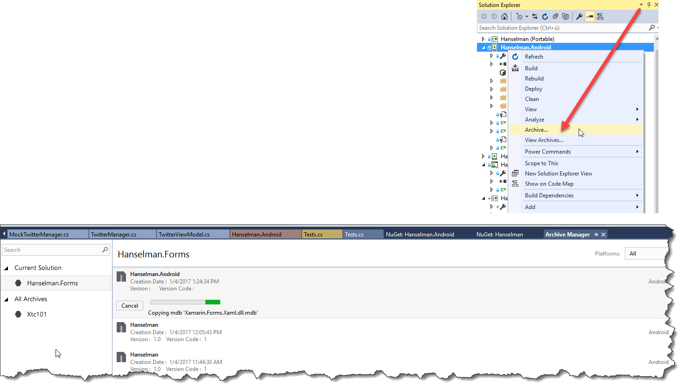
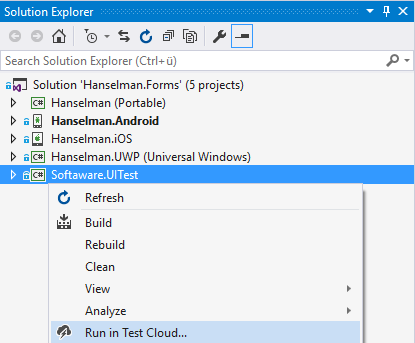
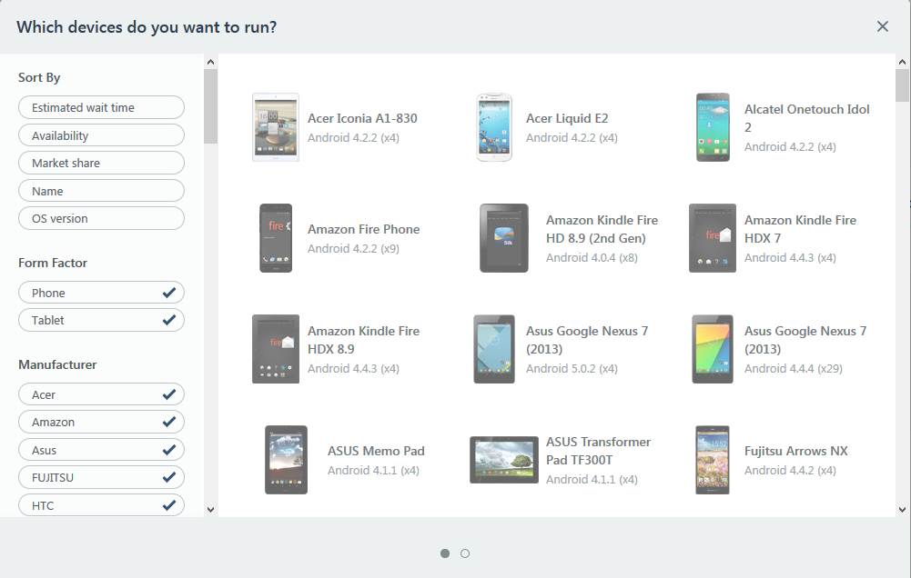
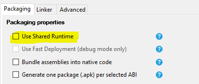
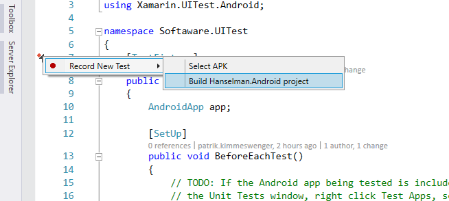
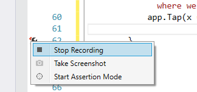
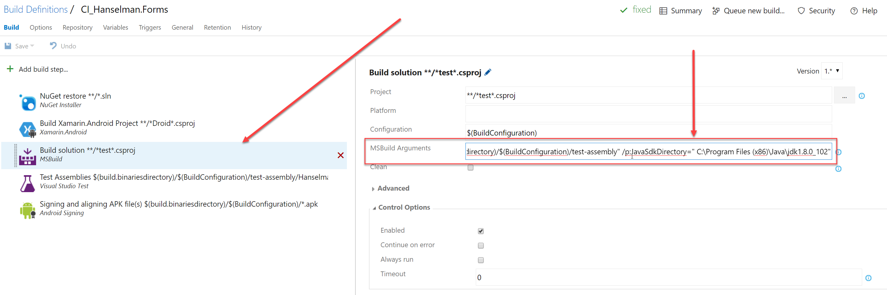

# Automated Testing using Xamarin Test Cloud

## Learnings

1. [How to sign up for a Xamarin Test Cloud account](#sign-up-for-a-free-trial-of-xamarin-test-cloud)  
1. [Create a coded UI test](#create-a-new-test-project-in-visual-studio)  
1. [Run tests in the cloud ](#run-tests)  
1. [Record an UI test by using Xamarin Test Recorder](#record-tests-using-test-recorder)  


## Sign up for a free trial of Xamarin Test Cloud
1. Open [Xamarin Website](https://www.xamarin.com/)
1. Choose Products > Xamarin Test Cloud
1. Click on "Start your free trial"
   
1. Register<br/>
   

## Create a new Test Project in Visual Studio
1. Open **Visual Studio**
1. Open the **Hanselman.Forms** solution
1. Add a new **Class Library** Project called "Hanselman.UI.Tests"
   
1. **Rename** ```Class1.cs``` to ```Tests.cs```
1. Add **NuGet** packages<br/>
   **Important: choose the specified versions:** Xamarin.UITest requires NUnit 2.6.3 or higher. Xamarin.UITest is not compatible with NUnit 3.0.

   * ```Install-Package NUnit -Version 2.6.4 ```
   * ```Install-Package NUnitTestAdapter -Version 2.0.0```
   * ```Install-Package Xamarin.UITest -Version 1.3.8```

   
1. Reference your Android project **Hanselman.Android** by clicking **Add Reference...** on the references of your UI test project.

## Create your first test
```cs
[TestFixture]
public class Tests
{
    private IApp app;

    [SetUp]
    public void BeforeEachTest()
    {
        app = ConfigureApp
            .Android
            .StartApp();
    }

    [Test]
    public void AppLaunches()
    {
        app.Screenshot("First screen.");
    }
}
```

## Create a more advanced test

Detailed functionality can be found at [Xamarin.UITest.IApp](https://developer.xamarin.com/api/type/Xamarin.UITest.IApp/), e.g.
* Back
* Tap / DoubleTap
* EnterText
* PressEnter
* PinchToZoomIn
* SetOrientationLandscape / SetOrientationPortrait
* SwipeLeft / SwipeRight
* Screenshot

```cs
[Test]
public void ClickThroughTest()
{
    this.TestMenuItem("About");
    this.TestMenuItem("Blog");
    this.TestMenuItem("Twitter");
    this.TestMenuItem("Hanselminutes");
    this.TestMenuItem("Ratchet");
    this.TestMenuItem("Developers Life");
}

private void TestMenuItem(string name)
{
    app.WaitForElement(x => x.Marked("OK"));
    app.Tap(x => x.Marked("OK"));

    app.WaitForElement(x => x.Marked(name));
    app.Tap(x => x.Text(name));

    app.Screenshot(name);
}
```

## Run tests
1. Make a release build of the app
1. Create an .apk file<br/>
   
1. Publish to Xamarin Test Cloud   
   
1. Select target devices for the test (Note: Using the trial edition restricts the amount of parallel tested devices to 3.)
   

## Record tests using Test Recorder
**Important:** This feature is only available in Visual Studio Enterprise edition. Explain the idea or show the following steps live.

1. **Install the Xamarin Test Recorder** through Visual Studio > Tools > Extensions and Updates
1. Open the properties of your **Hanselman.Android** project and disable **Use Shared Runtime**<br/>
   
1. Open the **Tests.cs** class from your UI test project
1. Click on the Test Recorder icon and select **Record new test > Build Hanselman.Android project**<br/>
   
1. The app is started in the emulator, wait until it is loaded completely.
1. Click through several pages in the app, you will see the recorded actions live in Visual Studio
1. Go to Visual Studio to stop the current test case.<br/>
   

## Fix Build for UI Tests
Since the UI test assembly has a reference to the android project (to load the apk), the build on the hosted agent will fail because of the wrong JDK used by default.
To solve this, we need to set the SDK version explicitely for the build task. Instead of having a task UI as in the android build task, we simply set the build parameter for the build.
1. Edit the build definition
1. Select the task **Build Solution /*test*.csproj**
1. Add the following parameter as build argument
   ```/p:JavaSdkDirectory=" C:\Program Files (x86)\Java\jdk1.8.0_102"```
   


## Relevant Links:
* [NUnit](http://www.nunit.org/)
* [Introduction to Xamarin Test Cloud](https://developer.xamarin.com/guides/testcloud/introduction-to-test-cloud)  
* [Introdution to Xamarin.UITest](https://developer.xamarin.com/guides/testcloud/uitest/intro-to-uitest/)
* [Xamarin.UITest Quick Starts](https://developer.xamarin.com/guides/testcloud/uitest/quickstarts/)
* [Submitting UITests to Xamarin Test Cloud](https://developer.xamarin.com/guides/testcloud/uitest/working-with/submitting-tests-to-xamarin-test-cloud/)
