# HockeyApp Integration - Build and User Feedback

## Learnings

1. [Register to HockeyApp](#register-to-hockeyApp)
1. [Connection between VSTS and HockeyApp](#connection-between-vsts-and-hockeyapp)
1. [Build integration](#build-integration)
1. [HockeyApp integration in project](#hockeyapp-integration-in-project)
1. [Release Management in VSTS](#release-management-in-vsts)
1. [Build Enhancements for Release Pipeline](#build-enhancements-for-release-pipeline)

## Register to HockeyApp
1. Go to the [HockeyApp](https://www.hockeyapp.net/) page
1. Sign up for free (Button top right)
1. Enter your data
1. Select the **I'm a developer** checkbox
1. Click on the **Register** button to sign up.

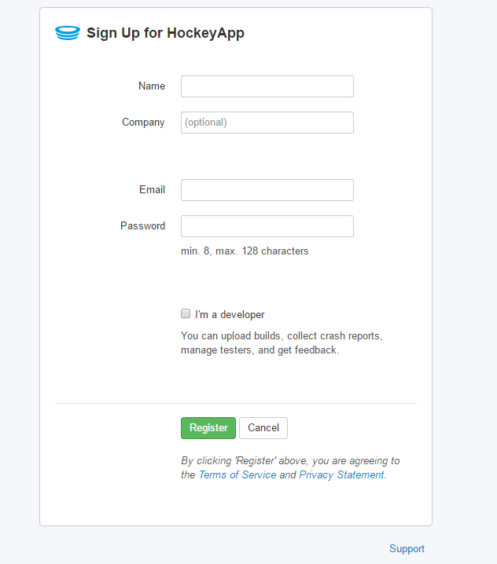

After signing up login to the created account to create a new app. In the first dialog choose **create the app manually instead**.<br/>

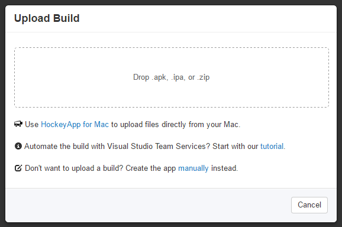

1. Select the platform (*Android*),
1. the release type (*beta*),
1. the title (*Hanselman.Forms*) and
1. the bundle identifier (*com.refractored.hanselman* - see AndroidManifest.xml)

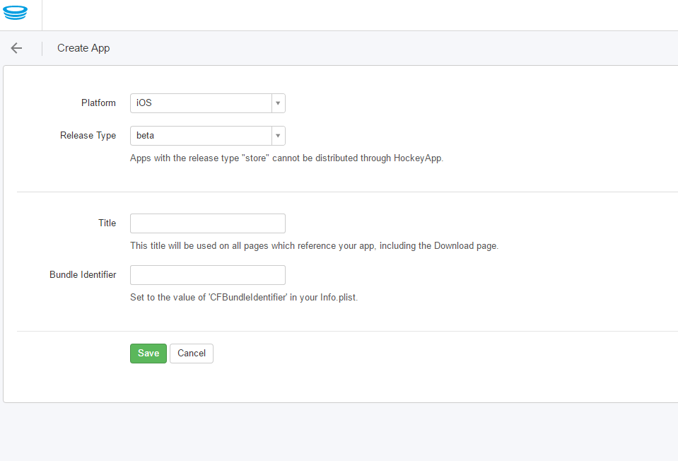

Click on **Save** to create the app.

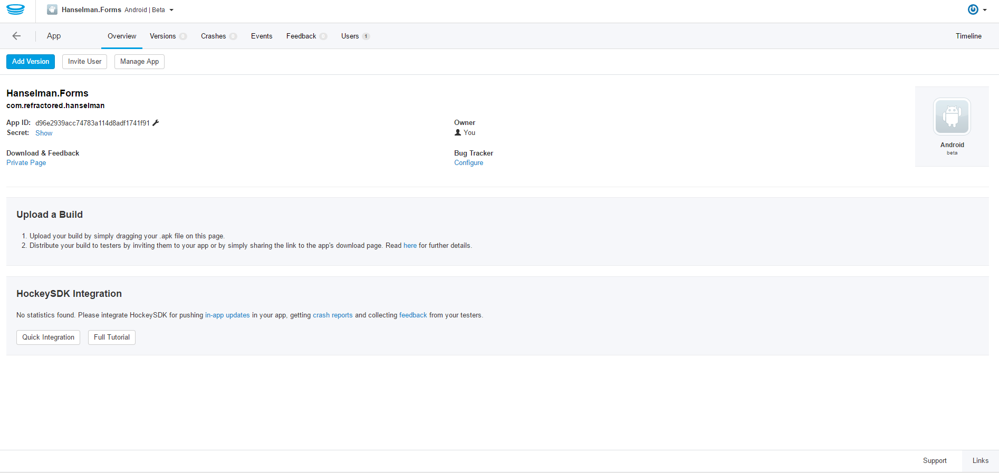

## Connection between VSTS and HockeyApp
1. Click on **Manage App** to go to the settings page.
2. Click on **Visual Studio Team Services**.
3. Click on **Configure**, enter your *VSTS* login infos and authorize the connection.

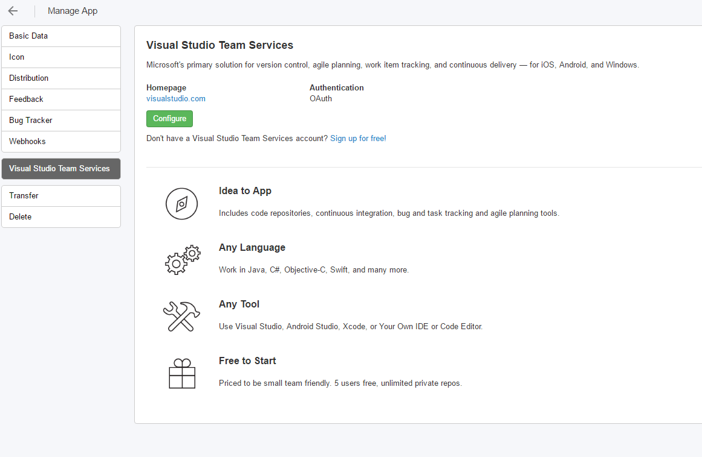

Choose the correct *VSTS* project and check **Auto Create Ticket** on **Crash Groups** and **Feedback**.

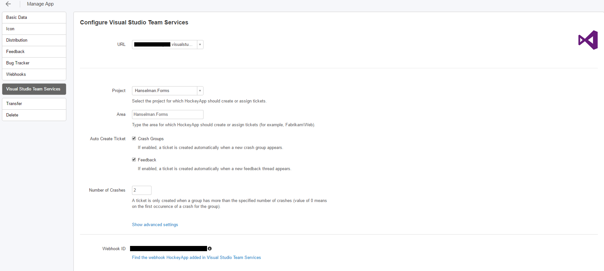

## Build integration
Next step is to integrate *HockeyApp* in the build automation process created in [**exercise 2**](exercise2.md). For build integration *VSTS* needs an api key of our *HockeyApp* account. Create this key in the **Account Settings** - **API Tokens** and copy it to the clipboard.

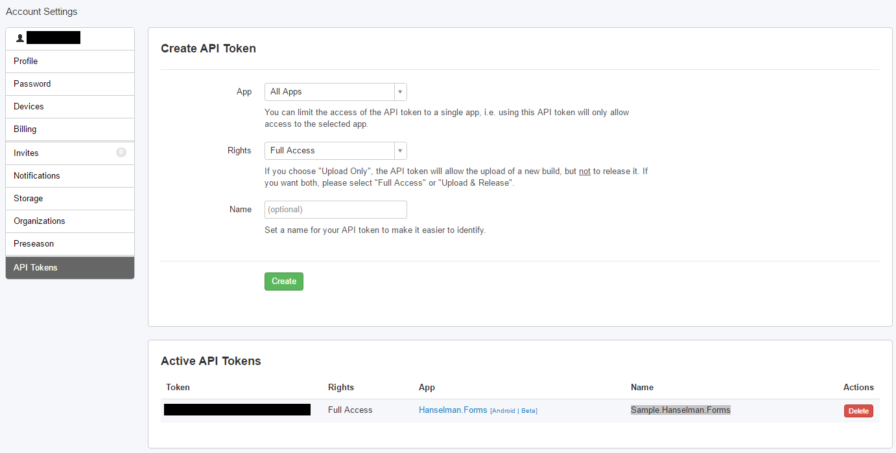

Install the **HockeyApp-Extension** from the **VSTS Marketplace.**

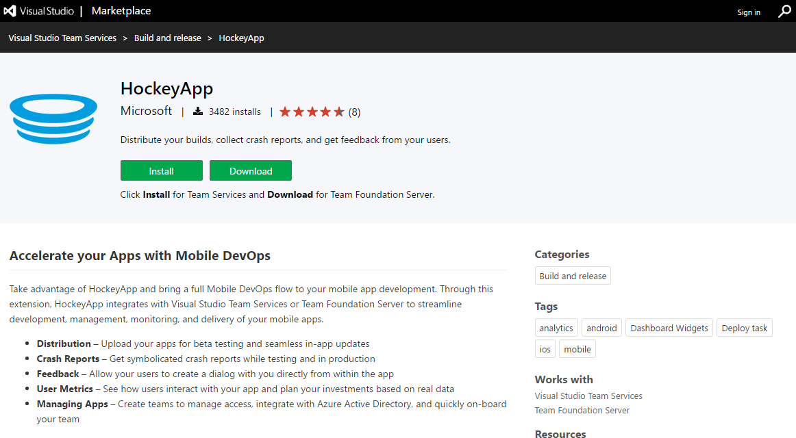

1. Open the created build definition and click on **Edit**.
1. Add new build step
1. Select the before installed **HockeyApp-Extension** (category "Deploy")
1. Click on close to add the selected task

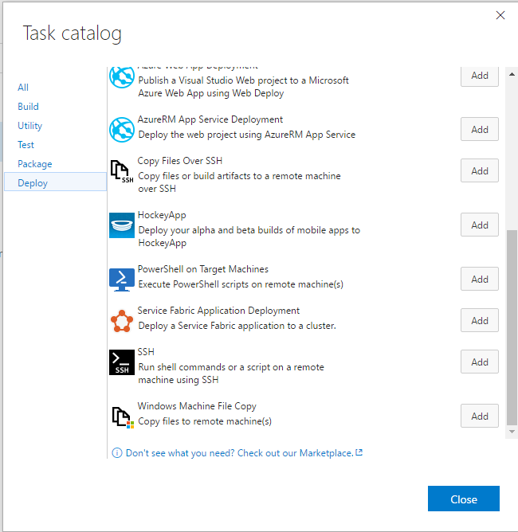

The added task needs a **HockeyApp Connection**.
1. Click on **Manage**, right beside the **HockeyApp Connection** input
1. Add new service endpoint
1. Choose **HockeyApp**
1. Input the name = "Sample.Hanselman.Forms"
1. Paste the *Api-Key* from clipboard

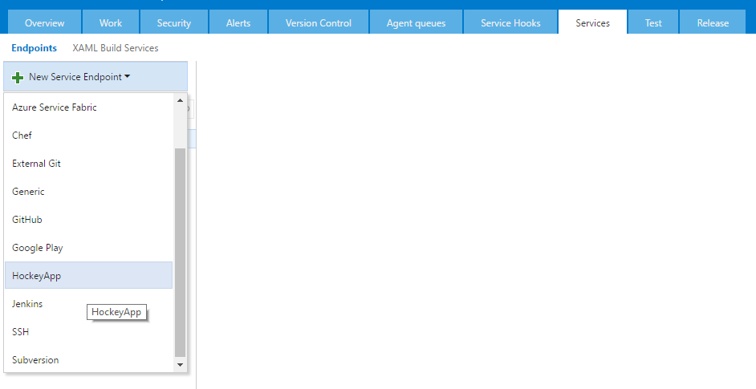

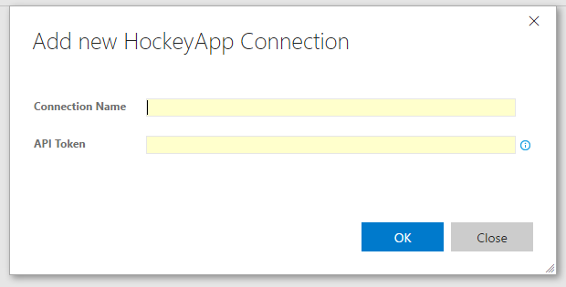

Back to the build definition (after refreshing) the "Sample.Hanselman.Forms" connection should appear.
Set the **Binary File Path** to ``` $(build.binariesdirectory)/$(BuildConfiguration)/*.apk ```

Save the build definition and queue a new build. 
After build succeeded the apk-File should appear in *HockeyApp*.

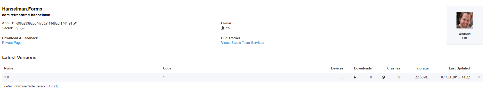

## HockeyApp integration in project

### Crash Reporting
1. Add NuGet package to the Android project: [HockeySDK.Xamarin ](https://www.nuget.org/packages/HockeySDK.Xamarin/)
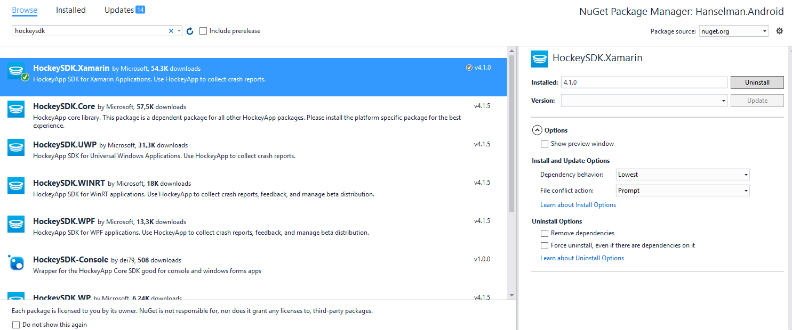

1. Add code to Properties/AssemblyInfo.cs
```cs
[assembly: MetaData("net.hockeyapp.android.appIdentifier", Value = "YOUR_APP_ID_FROM_HOCKEY_APP")]
```

1. Add code to **MainActivity**
```cs
CrashManager.Register(this);
```

### User Metrics
User Metrics is not automatically gathered, you have to start this manually. Add following code to **MainActivity**:
```cs
using HockeyApp.Android.Metrics;

MetricsManager.Register(Application);
```

### Custom Events
**Please note**: To use custom events, please first make sure that User Metrics is set up correctly, e.g. you registered the MetricsManager:

```cs
HockeyApp.MetricsManager.TrackEvent("Custom Event");
```

### User feedback integration in project
This will add the ability for your users to provide feedback from right inside your app. For a quick demo we're calling the two methods right after startup - usually you would create a button or menu entry and execute it there.

```cs
FeedbackManager.Register(Application);
FeedbackManager.ShowFeedbackActivity(ApplicationContext);
```

## Release Management in VSTS
**Target:** Two independent environments, one for development and one for production. The development version should deploy automatically to *HockeyApp* and the production version should deploy automatically to *Google Play Store*.

### 1. Environment: HockeyApp
1. Go to release view in *VSTS*
1. Click on **New Definition**
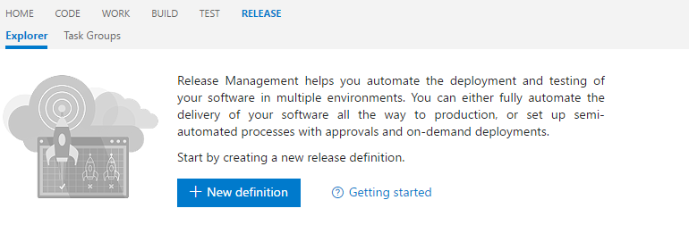

1. Select empty definition
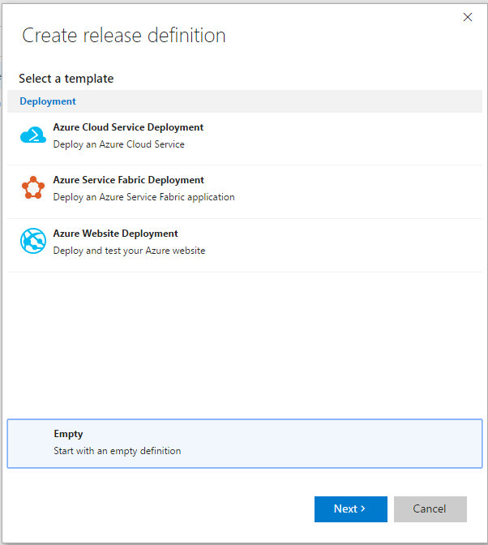

1. Select build (Build with Tests, but without HockeyApp auto deployment), project: 'Hanselman.Forms' and build definition: 'Build'. If desired use *continuouse deployment*. Select the default *Hosted* agent queue and click on the **Create** button.
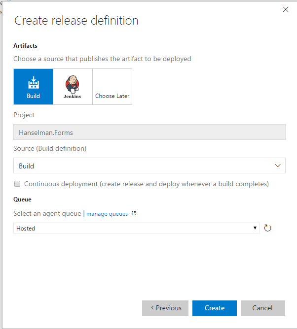

1. Change name to 'Android'
1. Change name of first, auto generated environment to 'HockeyApp'
1. Add deployment task **HockeyApp**, add **HockeyApp Connection** and set **Binary File Path** to
```cs
build/**/*.apk
```
1. Go to Artifacts tab, change name of source alias to **build**
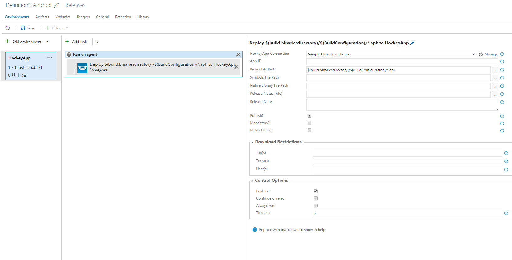

1. Save and start new release to test current settings
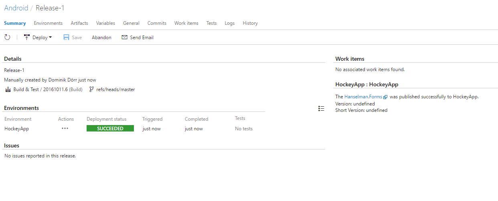

### 2. Environment: Google Play Store
1. Add a new environment
1. Select empty definition and choose a user from your project team in the pre-deployment approval. Activate the auto deployment trigger and select the default hosted queue.
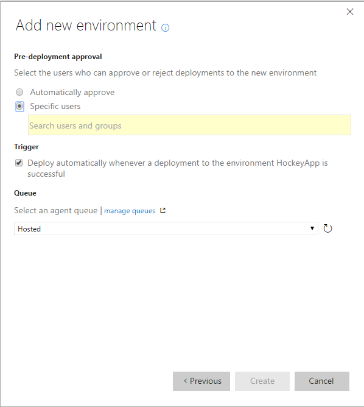

1. Change name of created environment to **Google Play Store**
1. Add new task and click on **Don't see what you need? Check out our Marketplace.** to get to the marketplace.
1. Search for **Google Play** and install the extension.
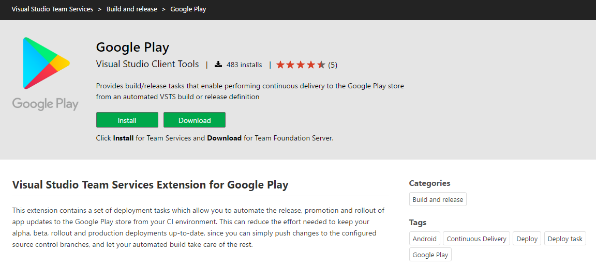

1. After installation, select the new deploy task **Google Play - Release**, add it and close the dialog.
1. Add a new **Service Endpoint** for your **Google Play developer account** and select it.
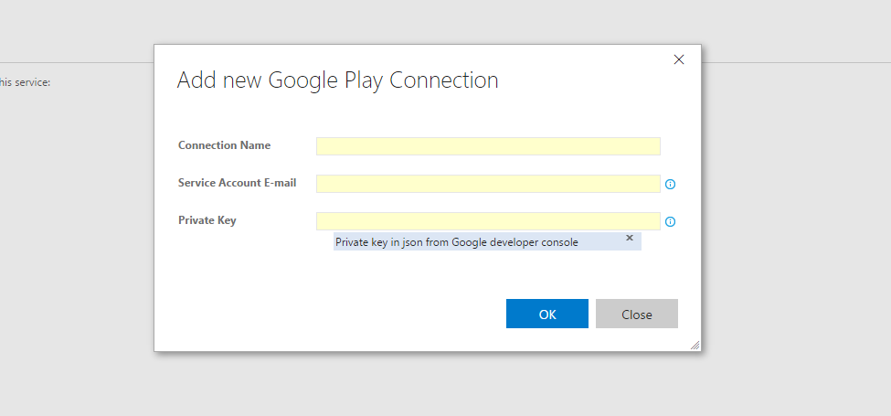

1. Set **APK Path** to and click on save
    ```cs
    build/**/*.apk
    ```

Now the following **Release Management** and **Build** order is configured:

1. New code is checked in

1. Build-Task **Build & Test** started automatically

1. If build succeeded, release management starts **HockeyApp - Deployment** and new version can be tested

1. After testing, new version has to be approved

1. When all specified users have approved the new version, release management starts deployement to **Google Play store** automatically

1. New version is online and all users of the app can update or download the new version

## Build Enhancements for Release Pipeline

### Setup KeyStore
Todo Marc
* Setup KeyStore
* Create private Reporting
* Use Keystore for Sigining
* Active ZipAlign

### Setup Assembly Versioning
In this step the build is extended with an assembly versioning task. This task is required to ensure, that every build has its own unique and consecutive version number assigned to the final deployed assemblies.

**Add Assembly Versioning Script**
1. In the main repository create a new folder **\Build** on the root level.
1. Add the powershell script [**AssemblyVersioning.ps1**](assets/exercise5/Build%20Scripts/AssemblyVersioning.ps1) to the **Build** folder and sync your changes.

**Add and configure versioning build task**
1. Navigate to the build definition that was created in  [**Exercise2**](exercise2.md) and move to the *edit* mode
1. From the **Build** tab select *Add build step...* and add a new **PowerShell** build task (*Utility > PowerShell > Add*).
1. Move the build task on top of all other tasks (drag and drop) and set the **Type** and **Script Path** as followed:  
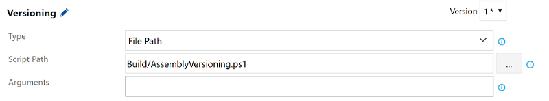
1. To provide unique and consecutive version information for the versioning script it is required to change the default *Build number format*. From the **General** tab change the *Build number format* as followed:  
```$(Build.DefinitionName)_$(MajorVersion).$(MinorVersion).$(date:yy)$(dayofyear)$(rev:.r)```
1. The previously set *Build number format* contains two configurable build variables that have to be defined. From the **Variables** tab add two additional custom variables by selecting *Add variable*: 
   * Name = **MajorVersion** / Value = **1**
   * Name = **MinorVersion** / Value = **0**

**Prepare source files**
1. To automatically version all required source files by the versioning script, it is mandatory to adjust some of the default patterns.
1. Find all *AndroidManifest.xml* files and set the versionCode and versionName to: ```android:versionCode="1" android:versionName="1.0.0"```

## Track Events in Application
To track telemetric data from an application it is required to react on events or measure metrics. This chapter describes all required steps to track the following data:
* Application Lifecycle Page View Event Tracking (Appear / Disappear)
* Application Metric Tracking (Duration Measurements)

1. Open the visual studio solution *Hanselman.Forms*
1. Create a new service interface **IEventTrackingService** (*Project: Hanselman.Portable/Helpers*)
   ```cs 
    namespace Hanselman.Portable.Helpers
    {
        public interface IEventTrackingService
        {
            void TrackEvent(string name, Dictionary<string, string> properties = null, Dictionary<string, double> measurements = null);
        }
    }
    ```
1. Create a new interface **IPageLifeCycleEvents** (*Project: Hanselman.Portable/Helpers*)
   ```cs 
    namespace Hanselman.Portable.Helpers
    {
        public interface IPageLifeCycleEvents
        {
            void OnAppearing();
            void OnDisappearing();
        }
    }
    ```
1. Create a new service implementation **EventTrackingService** (*Project: Hanselman.Android*). 
   * This service is responsible to forward application events to the the HockeyApp integration of the Microsoft Application Insights.
    ```cs
    [assembly: Dependency(typeof(HanselmanAndroid.Helpers.EventTrackingService))]
    namespace HanselmanAndroid.Helpers
    {
        public class EventTrackingService : IEventTrackingService
        {
            public void TrackEvent(string name, Dictionary<string, string> properties = null, Dictionary<string, double> measurements = null)
            {
                MetricsManager.TrackEvent(name, properties, measurements);
            }
        }
    }
1. In the **MainActivity** class (*Hanselman.Android*) override the **OnResume** and **OnPause** methods.
   * The telemetry tracking is only activated when the application is started. Otherwise it is stopped.
    ```cs
    protected override void OnResume()
    {
        base.OnResume();
        Tracking.StartUsage(this);
    }

    protected override void OnPause()
    {
        base.OnPause();
        Tracking.StopUsage(this);
    }
    ```
1. Implement the **IPageLifeCycle** interface in the **BaseViewModel** (*Hanselman.Portable*).
   ```cs
    public class BaseViewModel : INotifyPropertyChanged, IPageLifeCycleEvents
    {
        public BaseViewModel()
        {
            try
            {
                EventTrackingService = DependencyService.Get<IEventTrackingService>();
            }
            catch (Exception) { } // Bad Hack! Use a proper IoC implementation instead! DependencyService is not initialized for unit tests
       }
   ```
   ```cs
    public virtual  void OnAppearing()
    {
    }

    public virtual void OnDisappearing()
    {
    }
   ```
1. Add the **EventTrackingService** to the **BaseViewModel** implementation (*Hanselman.Portable*).
   * Define a field and property to store the service instance:
     ```cs
        private IEventTrackingService eventTrackingService;

        public bool CanLoadMore
        {
            get { return canLoadMore; }
            set { SetProperty(ref canLoadMore, value); }
        }

        protected IEventTrackingService EventTrackingService
        {
            get
            {
                return eventTrackingService;
            }

            private set
            {
                eventTrackingService = value;
            }
        }
     ```   
   * Resolve the service from the service locator:
     ```cs
     public BaseViewModel()
     {
         EventTrackingService = DependencyService.Get<IEventTrackingService>();
     }
     ```
1. Create a new base implementation **ContentPageBase** (*Project: Hanselman.Portable/Views*)
   * This class will serve as base class for all content views. By adding a base implementation the service *EventTrackingService* can be managed from one place and provide telemetric data for multiple content view pages.
    ```cs
    namespace Hanselman.Portable.Views
    {
        public class ContentPageBase : ContentPage
        {
            private IEventTrackingService eventTrackingService;
            private Stopwatch stopWatch;

            public ContentPageBase()
            {
                eventTrackingService = DependencyService.Get<IEventTrackingService>();

            }
            protected override void OnAppearing()
            {
                base.OnAppearing();
                if (eventTrackingService != null)
                {
                    eventTrackingService.TrackEvent("PageView", new Dictionary<string, string>() { { "View", this.GetType().Name } });
                }
                stopWatch = Stopwatch.StartNew();

                var lifecycleEvent = this.BindingContext as IPageLifeCycleEvents;
                if(lifecycleEvent != null)
                {
                    lifecycleEvent.OnAppearing();
                }
            }

            protected override void OnDisappearing()
            {
                base.OnDisappearing();
                if (eventTrackingService != null && stopWatch != null)
                {
                    stopWatch.Stop();
                    eventTrackingService.TrackEvent("PageVisitDuration", new Dictionary<string, string> { { "View", this.GetType().Name } }, new Dictionary<string, double>() { {"Duration", stopWatch.ElapsedMilliseconds} });
                    stopWatch = null;
                }

                var lifecycleEvent = this.BindingContext as IPageLifeCycleEvents;
                if (lifecycleEvent != null)
                {
                    lifecycleEvent.OnDisappearing();
                }
            }
    ```
1. Change the base class for all Pages and Views (*Code behind classes*) to the new base class **ContentPageBase** instead of **ContentPage** (*Project: Hanselman.Portable/Views*)
   * Example for AboutPage.cs
     ```cs
     public partial class AboutPage : ContentPageBase
     ```
1. Replace the page content type for all Pages with the new **ContentPageBase** implementation and add the required **namespace** for referencing ContentPageBase.
   * Example for AboutPage.xaml
        ```cs
        <?xml version="1.0" encoding="utf-8" ?>
        <base:ContentPageBase 
                    xmlns="http://xamarin.com/schemas/2014/forms"
                    xmlns:x="http://schemas.microsoft.com/winfx/2009/xaml"
                    xmlns:controls="clr-namespace:Hanselman.Portable.Helpers;assembly=Hanselman.Portable"
                    xmlns:base="clr-namespace:Hanselman.Portable.Views;assembly=Hanselman.Portable"
                    x:Class="Hanselman.Portable.Views.AboutPage"
                    Title="Scott Hanselman">
    ```
1. Extend the method **ExecuteLoadTweetsCommand** in the **TwitterViewModel** (*Hanselman.Portable*) with an additional tweet duration measurement that is sent to HockeyApp Application Insights for metric tracking.
   * Start a new Stopwatch session at the beginning of the method:
     ```cs
     public async Task ExecuteLoadTweetsCommand()
     {
         var sw = Stopwatch.StartNew();
         ...
     ```
   * Stop and track an event when the tweets finished loading:
     ```cs
     ...
         await page.DisplayAlert("Error", "Unable to load tweets.", "OK");
     }

     sw.Stop();
     if(EventTrackingService != null)
     {
         EventTrackingService.TrackEvent("TwitterLoading", measurements: new Dictionary<string, double>() { { "Duration", sw.ElapsedMilliseconds } });
     }
     sw = null;
     ...
     ```

## HockeyApp Application Insights Integration
In order to analyse the event data, we can integrate the events from HockeyApp into an Instance of Application Insights. To do so, we need to create a new Application Insights instance in Azure.

1. Go to the [Azure Portal](http://portal.azure.com) and log in with your account.
1. Create a new resource of type Application Insights.
1. Within the creation wizard, specificy the type to **HockeyApp bridge application**.<br/>
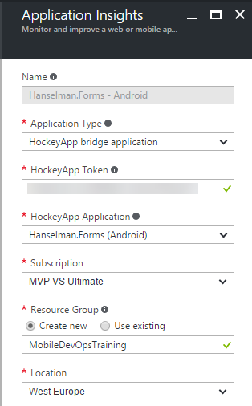 
   1. Use the API Key from your HockeyApp instance.
   

## Application Insights Analytics
After we have successfully created the bridge to Application Insights, we can use the Analytics tools to query and analyse the reported events.

1. Click on the Analytics icon in Application Insights.<br/>
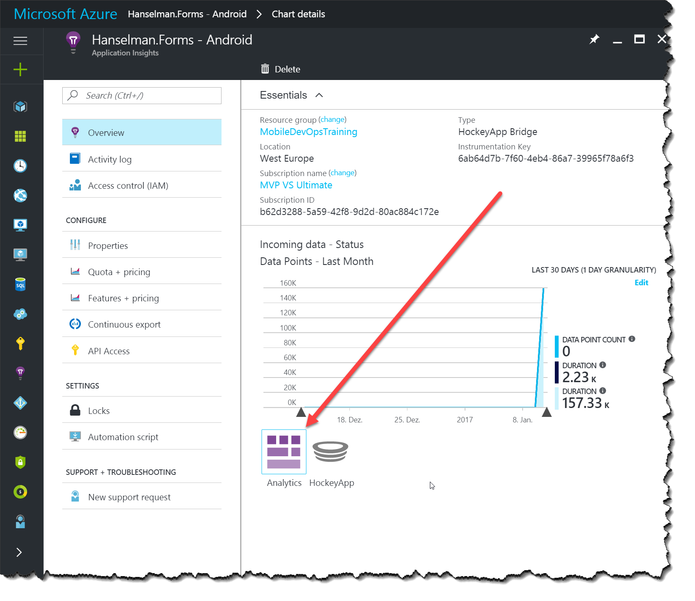
1. Create a new Query tab and play around with the query language and rendering functions.
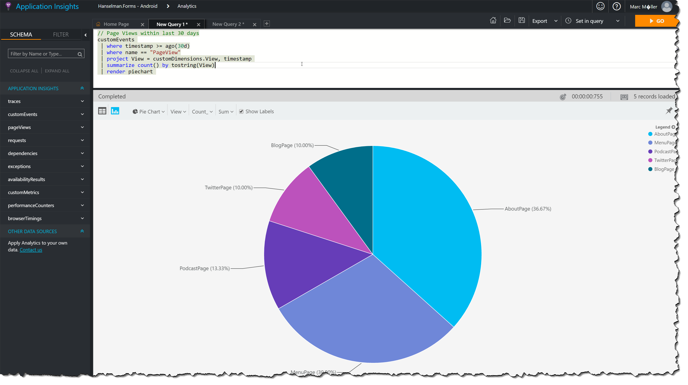
  
   You can start with the following queries:
   ```
    // Page Views within last 30 days
    customEvents 
    | where timestamp >= ago(30d)
    | where name == "PageView"
    | project View = customDimensions.View, timestamp 
    | summarize count() by tostring(View)
    | render piechart 
   ```

   ```
    // Page Visit duration within last 30 days
    customEvents 
    | where timestamp >= ago(30d)
    | where name == "PageVisitDuration"
    | project View = customDimensions.View, Duration = customMeasurements.Duration, timestamp 
    | summarize avg(todouble(Duration)) by tostring(View) 
    | render barchart  
   ```