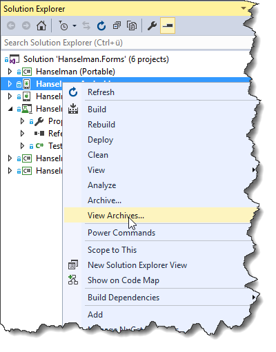
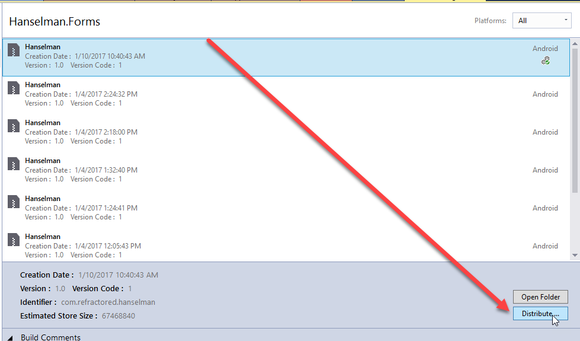
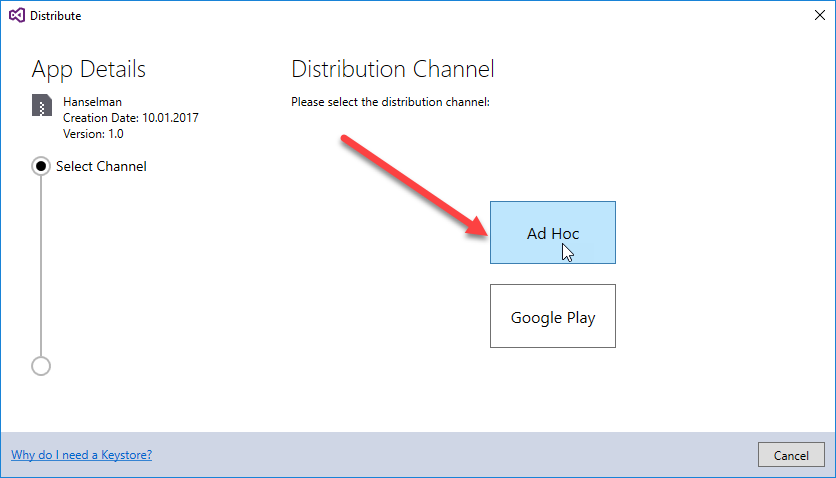
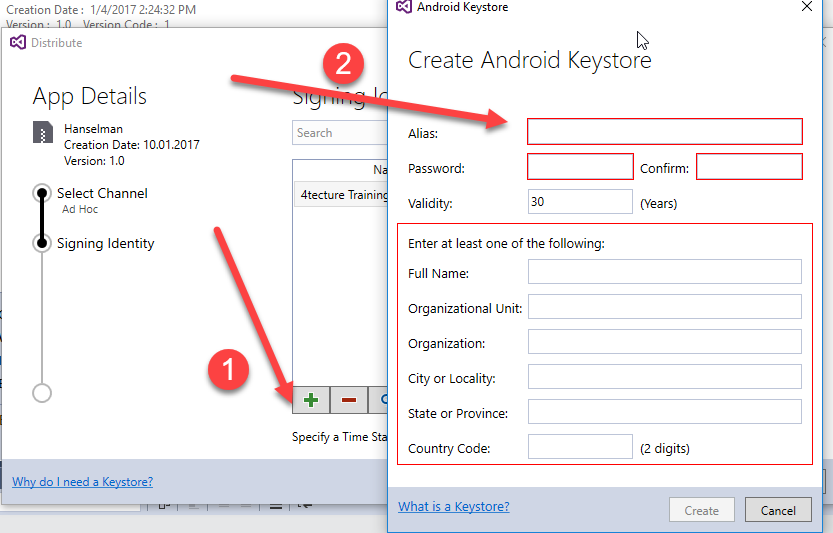
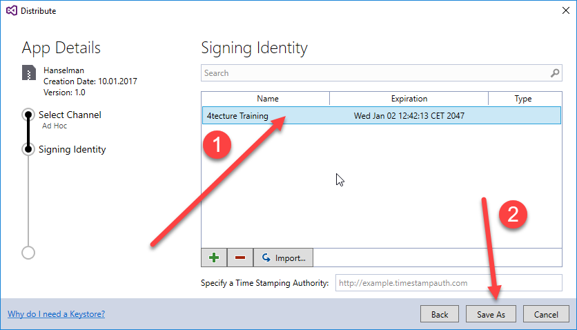
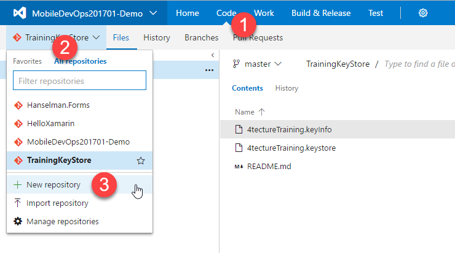
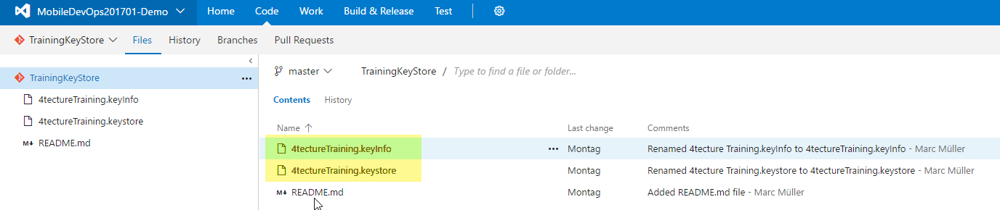
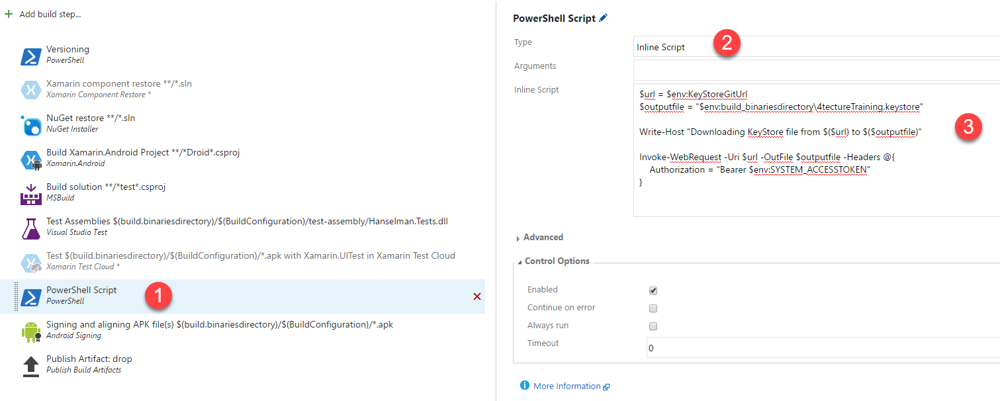
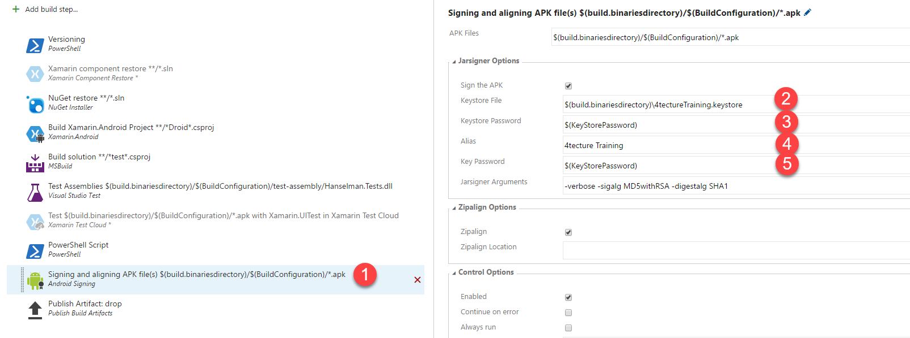
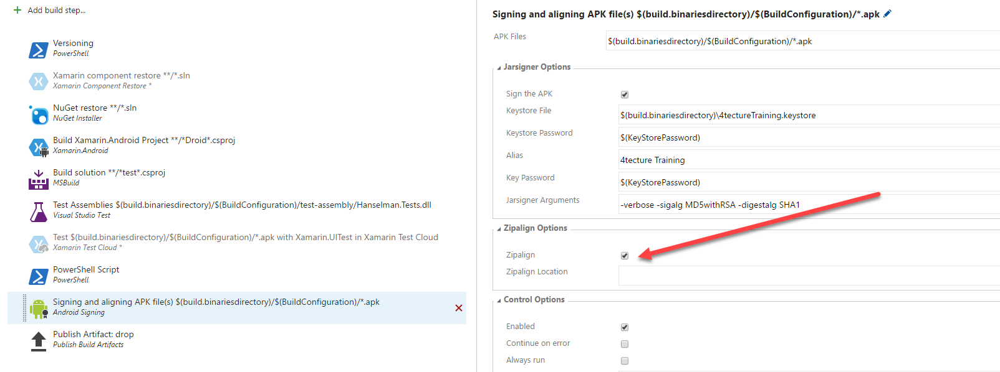

# HockeyApp Integration - Build and User Feedback

## Learnings

1. [Register to HockeyApp](#register-to-hockeyApp)
1. [Connection between VSTS and HockeyApp](#connection-between-vsts-and-hockeyapp)
1. [Build integration](#build-integration)
1. [HockeyApp integration in project](#hockeyapp-integration-in-project)
1. [Release Management in VSTS](#release-management-in-vsts)

## Register to HockeyApp
1. Go to the [HockeyApp](https://www.hockeyapp.net/) page
1. Sign up for free (Button top right)
1. Enter your data
1. Select the **I'm a developer** checkbox
1. Click on the **Register** button to sign up.


After signing up login to the created account to create a new app. In the first dialog choose **create the app manually instead**.<br/>


1. Select the platform (*Android*),
1. the release type (*beta*),
1. the title (*Hanselman.Forms*) and
1. the bundle identifier (*com.refractored.hanselman* - see AndroidManifest.xml)


Click on **Save** to create the app.


## Connection between VSTS and HockeyApp
1. Click on **Manage App** to go to the settings page.
2. Click on **Visual Studio Team Services**.
3. Click on **Configure**, enter your *VSTS* login infos and authorize the connection.


Choose the correct *VSTS* project and check **Auto Create Ticket** on **Crash Groups** and **Feedback**.


## Build integration
Next step is to integrate *HockeyApp* in the build automation process created in [**exercise 2**](exercise2.md). For build integration *VSTS* needs an api key of our *HockeyApp* account. Create this key in the **Account Settings** - **API Tokens** and copy it to the clipboard.


Install the **HockeyApp-Extension** from the **VSTS Marketplace.**


1. Open the created build definition and click on **Edit**.
1. Add new build step
1. Select the before installed **HockeyApp-Extension** (category "Deploy")
1. Click on close to add the selected task


The added task needs a **HockeyApp Connection**.
1. Click on **Manage**, right beside the **HockeyApp Connection** input
1. Add new service endpoint
1. Choose **HockeyApp**
1. Input the name = "Sample.Hanselman.Forms"
1. Paste the *Api-Key* from clipboard


Back to the build definition (after refreshing) the "Sample.Hanselman.Forms" connection should appear.
Set the **Binary File Path** to ``` $(build.binariesdirectory)/$(BuildConfiguration)/*.apk ```

Save the build definition and queue a new build. 
After build succeeded the apk-File should appear in *HockeyApp*.


## HockeyApp integration in project

### Crash Reporting
1. Add NuGet package to the Android project: [HockeySDK.Xamarin ](https://www.nuget.org/packages/HockeySDK.Xamarin/)


1. Add code to Properties/AssemblyInfo.cs
```cs
[assembly: MetaData("net.hockeyapp.android.appIdentifier", Value = "YOUR_APP_ID_FROM_HOCKEY_APP")]
```

1. Add code to **MainActivity**
```cs
CrashManager.Register(this);
```

### User Metrics
User Metrics is not automatically gathered, you have to start this manually. Add following code to **MainActivity**:
```cs
using HockeyApp.Android.Metrics;

MetricsManager.Register(Application);
```

### Custom Events
**Please note**: To use custom events, please first make sure that User Metrics is set up correctly, e.g. you registered the MetricsManager:

```cs
HockeyApp.MetricsManager.TrackEvent("Custom Event");
```

### User feedback integration in project
This will add the ability for your users to provide feedback from right inside your app. For a quick demo we're calling the two methods right after startup - usually you would create a button or menu entry and execute it there.

```cs
FeedbackManager.Register(Application);
FeedbackManager.ShowFeedbackActivity(ApplicationContext);
```

## Release Management in VSTS
**Target:** Two independent environments, one for development and one for production. The development version should deploy automatically to *HockeyApp* and the production version should deploy automatically to *Google Play Store*.

### 1. Environment: HockeyApp
1. Go to release view in *VSTS*
1. Click on **New Definition**


1. Select empty definition


1. Select build (Build with Tests, but without HockeyApp auto deployment), project: 'Hanselman.Forms' and build definition: 'Build'. If desired use *continuouse deployment*. Select the default *Hosted* agent queue and click on the **Create** button.


1. Change name to 'Android'
1. Change name of first, auto generated environment to 'HockeyApp'
1. Add deployment task **HockeyApp**, add **HockeyApp Connection** and set **Binary File Path** to
```cs
build/**/*.apk
```
1. Go to Artifacts tab, change name of source alias to **build**


1. Save and start new release to test current settings


### 2. Environment: Google Play Store
1. Add a new environment
1. Select empty definition and choose a user from your project team in the pre-deployment approval. Activate the auto deployment trigger and select the default hosted queue.


1. Change name of created environment to **Google Play Store**
1. Add new task and click on **Don't see what you need? Check out our Marketplace.** to get to the marketplace.
1. Search for **Google Play** and install the extension.


1. After installation, select the new deploy task **Google Play - Release**, add it and close the dialog.
1. Add a new **Service Endpoint** for your **Google Play developer account** and select it.


1. Set **APK Path** to and click on save
    ```cs
    build/**/*.apk
    ```

Now the following **Release Management** and **Build** order is configured:

1. New code is checked in

1. Build-Task **Build & Test** started automatically

1. If build succeeded, release management starts **HockeyApp - Deployment** and new version can be tested

1. After testing, new version has to be approved

1. When all specified users have approved the new version, release management starts deployement to **Google Play store** automatically

1. New version is online and all users of the app can update or download the new version

## Build Enhancements for Release Pipeline

### Setup KeyStore
In order to deploy the application to real devices, we need to sign the package which is generated by the build process. To do so, we need a KeyStore. But where do we save it? In the source code repository? Not really. There are many different approaches to do so. It is important that secure information is not disclosed. In this sample, we will store the KeyStore in a private Repository, where only the Administrator and the build service have access to.

1. Open the context menu on your android project and click on **View Archives...**

   
1. Click on Distribute

   
1. Click on Ad Hoc

   
1. Click on the "+" sign and fill out the form to create a new key store

   
1. Select the Keystore and click on **Save as**

   
1. Store the key store to your hard drive. We will shortly add those to the private Git repository.
1. Now go to your VSTS account and create a new Git repository in your team project.

   
1. Clone the Repository to your local hard drive and add the keystore files on the root level of the repository.
1. Add the files, commit the changes and push the changes to the remote repository. They should now be on your private repository on VSTS.

   

We now have the KeyStore availabe, but now we need to integrate in into the build. The build itself is already configured to use another repository. Therefore we need something else to do so. Lukily we can access VSTS repositories by API and this is how we download the keystore file for our build.
1. Open the build definition and click edit.
1. Add another build task of type **PowerShell**.
1. Move the task before the signing task.
1. Choose "Inline Script" as Type and add the following PowerShell code to it.
   ```
   $url = $env:KeyStoreGitUrl
   $outputfile = "$env:build_binariesdirectory\4tectureTraining.keystore"

   Write-Host "Downloading KeyStore file from $($url) to $($outputfile)"

   Invoke-WebRequest -Uri $url -OutFile $outputfile -Headers @{
       Authorization = "Bearer $env:SYSTEM_ACCESSTOKEN"
   }
   ```
   The result should look like this:

   
1. Update the Signing Task to use the keystore file from the download location of the above script. Use variables for the password. Please check that the file names and alias names matches with your created keystore.

   
1. We now need two additional variables for our build definition. One for the Git API Url and one for the secure password.
   1. Create a variable "KeyStorePassword" and mark it as secure variable.
   1. Create a variable "KeyStoreGitUrl" with the following value (replace the tokens with your settings):
   ```
   https://<vstsaccount>.visualstudio.com/<teamproject>/_apis/git/repositories/<repositoryname>/items?api-version=1.0&scopepath=<filename>.keystore
   ```

### Activate ZipAlign
Please set the option to "ZipAlign" in the singin task to true (check the checkbox):



### Setup Assembly Versioning
Todo Jan
* Add Powershell to Reporting
* Add PowerShel Task
* Set Variables and Build Number Definition
* Prepare are source files for Pattern d.d.d.d

## Track Events in Application
Todo Jan:
* IEventTrackerService
* EventTrackerService
* ContentPageBase
* ViewModelBase with ILifecycleEvents
* Change base class for all views (xaml + namespace, code behind)
* TwitterViewModel for Loading time

## HockeyApp Application Insights Integration
In order to analyse the event data, we can integrate the events from HockeyApp into an Instance of Application Insights. To do so, we need to create a new Application Insights instance in Azure.

1. Go to the [Azure Portal](http://portal.azure.com) and log in with your account.
1. Create a new resource of type Application Insights.
1. Within the creation wizard, specificy the type to **HockeyApp bridge application**.<br/>
 
   1. Use the API Key from your HockeyApp instance.
   

## Application Insights Analytics
After we have successfully created the bridge to Application Insights, we can use the Analytics tools to query and analyse the reported events.

1. Click on the Analytics icon in Application Insights.<br/>

1. Create a new Query tab and play around with the query language and rendering functions.

  
   You can start with the following queries:
   ```
    // Page Views within last 30 days
    customEvents 
    | where timestamp >= ago(30d)
    | where name == "PageView"
    | project View = customDimensions.View, timestamp 
    | summarize count() by tostring(View)
    | render piechart 
   ```

   ```
    // Page Visit duration within last 30 days
    customEvents 
    | where timestamp >= ago(30d)
    | where name == "PageVisitDuration"
    | project View = customDimensions.View, Duration = customMeasurements.Duration, timestamp 
    | summarize avg(todouble(Duration)) by tostring(View) 
    | render barchart  
   ```