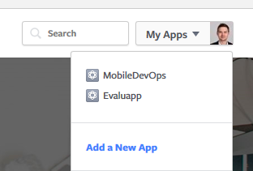
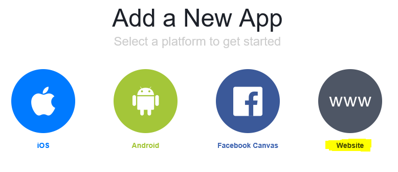
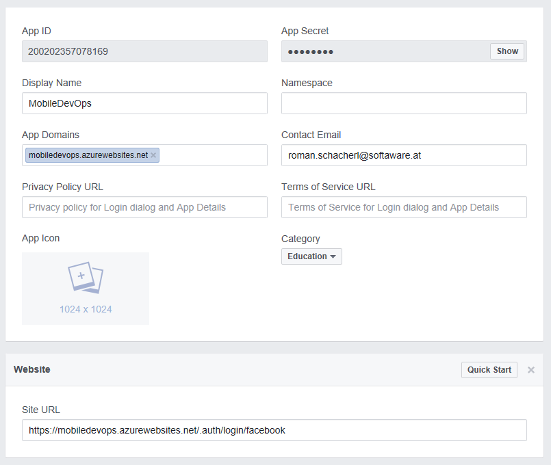
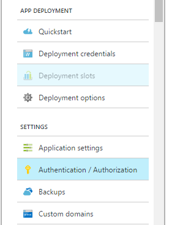

# Enriching your Mobile Application with Services

## Learnings

## Create a Mobile App in Azure
1. Login to your Azure Portal
1. Create a new **Mobile App**<br/>
    
1. Enter a name, choose or create a Resource group and an App Service Plan
1. Remember the URL of your mobile service (```https://<YOUR_MOBILE_SERVICE>.azurewebsites.net```), you'll need it for the facebook setup

## Create a facebook app
1. Open the [Facebook Developer](https://developers.facebook.com/) page
1. Create a new app<br/>
    
1. Select **Website** (not Android)<br/>
    
1. Choose **App Review** and make your facebook app public<br/>
    
1. Choose **Settings** and set up your facebook app<br/>
    - **App Domains:** Add the domain of your mobile service
    - Click on **Add Platform** at the bottom
    - **Site URL:** set to ```https://<YOUR_MOBILE_SERVICE>/.auth/login/facebook``` (**Note:** take https, not http)
        

## Join Azure Mobile App and Facebook     
1. Copy the App ID and the App Secret from the facebook Portal
1. Switch to your Mobile App in the Azure Portal
1. Click on **Authentication / Authorization**    
    
1. Set **App Service Authentication** to **On**
1. Configure **Facebook** Authentication provider
    
1. Click on **OK**

## Integrate Facebook Authentication in your App
### Changes in your Portable project
1. Discuss the advantages of creating interfaces in the portable project (the platform specific implementations will be added to the Android project)
1. Create a folder named **Auth**
1. Create a new interface **IAuthenticate**
    ```cs
    public interface IAuthenticate
    {
        Task<bool> Authenticate();

        bool IsAuthenticated { get; }
    }    
    ```
1. Create a new interface **ILoginManager**   
    ```cs
    public interface ILoginManager
    {
        void ShowMainPage();
        void ShowLogin();
    } 
    ```
1. Open the **App.cs** file
1. Add an **Authenticator** to your App class and initialize it 
    ```cs    
    public static IAuthenticate Authenticator { get; private set; }

    public static void Init(IAuthenticate authenticator)
    {
        Authenticator = authenticator;
    }
    ```
1. Add a Forms Xaml View named **LoginPage.xaml** to your Views-folder
    ```xml
        <?xml version="1.0" encoding="UTF-8" ?>
        <ContentPage x:Class="Hanselman.Portable.Views.LoginPage"
                    xmlns="http://xamarin.com/schemas/2014/forms"
                    xmlns:x="http://schemas.microsoft.com/winfx/2009/xaml"
                    xmlns:controls="clr-namespace:ImageCircle.Forms.Plugin.Abstractions;assembly=ImageCircle.Forms.Plugin.Abstractions"
                    Title="{Binding Title}">
            <ContentPage.Content>

                <StackLayout HorizontalOptions="FillAndExpand"
                            Spacing="30"
                            VerticalOptions="Center">
                    <Label FontSize="30"
                        HorizontalOptions="Center"
                        Text="Welcome, please sign-in" />
                    <Button x:Name="loginButton"
                            Clicked="loginButton_Clicked"
                            FontSize="20"
                            HorizontalOptions="Center"
                            MinimumHeightRequest="30"
                            Text="Sign-in with Facebook"
                            VerticalOptions="CenterAndExpand" />
                </StackLayout>
            </ContentPage.Content>
        </ContentPage>
    ```
1. Add some code-behind code in the **LoginPage.xaml.cs**<br/>
    ```cs
    public partial class LoginPage : ContentPage
    {
        private readonly ILoginManager loginManager;

        public LoginPage(ILoginManager loginManager)
        {
            InitializeComponent();

            this.loginManager = loginManager;

            BindingContext = new BaseViewModel
            {
                Title = "Hanselman.Forms"
            };
        }

        public async void loginButton_Clicked(object sender, EventArgs e)
        {
            // See App.OnResume to see what happens after login
            await App.Authenticator.Authenticate();
        }
    }
    ```
1. Add code to your **App.cs** class
    - Implement the **ILoginManager** interface (ShowMainPage, ShowLogin)
    - Set the main page to your newly created **LoginPage**  
    - Override the **OnResume** method   
    ```cs
    public class App : Application, ILoginManager
    {
        public App()
        {
            MainPage = new LoginPage(this);
        }

        public static IAuthenticate Authenticator { get; private set; }

        public static void Init(IAuthenticate authenticator)
        {
            Authenticator = authenticator;
        }

        protected override void OnResume()
        {
            if (Authenticator.IsAuthenticated)
            {
                this.ShowMainPage();
            }
            else
            {
                this.ShowLogin();
            }
        }

        public void ShowMainPage()
        {
            MainPage = new RootPage();
        }

        public void ShowLogin()
        {
            MainPage = new LoginPage(this);
        }
    }
    ```
1. Add the **NuGet** package ```Microsoft.Azure.Mobile.Client``` to your portable project     
1. Add a new class **ServiceClientManager** to your root folder
    ```cs
    public class ServiceClientManager
    {
        private static ServiceClientManager instance;

        private ServiceClientManager()
        {
            this.Client = new MobileServiceClient(new Uri("http://<YOUR_MOBILE_SERVICE>.azurewebsites.net/"));
        }

        public MobileServiceClient Client { get; private set; }

        public static ServiceClientManager Instance
        {
            get
            {
                if (instance == null)
                {
                    instance = new ServiceClientManager();
                }
                return instance;
            }
        }
    }
    ```

### Changes in your Android project   
1. Open **MainActivity.cs**
1. Add a private field called **user** and a property **IsAuthenticated**<br/>
    ```cs
    private MobileServiceUser user;
    public bool IsAuthenticated { get; private set; }
    ```
1. Call ```App.Init(this);``` **before** LoadApplication in the **OnCreate** method
1. Implement **IAuthenticate** interface in MainActivity
1. Add **Authenticate** method
    ```cs
    public async Task<bool> Authenticate()
    {
        this.IsAuthenticated = false;
        var message = string.Empty;
        try
        {
            // Sign in with Facebook login using a server-managed flow.
            user = await ServiceClientManager.Instance.Client.LoginAsync(this, MobileServiceAuthenticationProvider.Facebook);

            if (user != null)
            {
                message = string.Format("you are now signed-in as {0}.", user.UserId);
                this.IsAuthenticated = true;
            }
        }
        catch (Exception ex)
        {
            // TODO: show error dialog
            message = ex.Message;
        }

        return this.IsAuthenticated;
    }    
    ```


## Further Resources    
- [How to configure your App Service application to use Facebook login](https://azure.microsoft.com/en-gb/documentation/articles/app-service-mobile-how-to-configure-facebook-authentication/)
- [Add authentication to your Xamarin.Forms app](https://azure.microsoft.com/en-gb/documentation/articles/app-service-mobile-xamarin-forms-get-started-users/)
